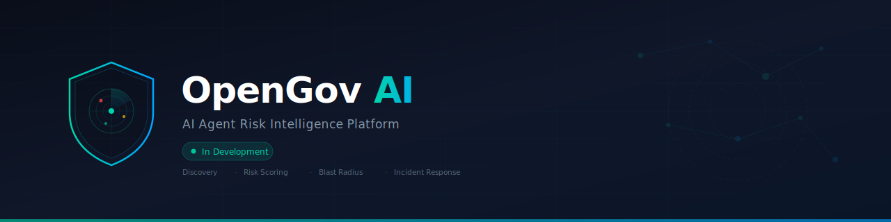

<p align="center">
  
</p>

<p align="center">
  
  
  
  
  
  
</p>

---

> **⚠️ This project is under active development. Not production-ready.**  
> We're building in public. Interested in early access? [Open an issue](../../issues).

---

## What is OpenGov AI?

**OpenGov AI** is the **AI Agent Risk Intelligence** platform. We discover every AI agent and MCP server in your environment, quantify the business risk of each one, and give your security team instant response capabilities when something goes wrong.

We don't compete with your MCP gateway — we make it smarter. Deploy in 24 hours. See your first risk assessment tomorrow.

### Why This Exists

Enterprise AI adoption is exploding. Developers run dozens of AI coding agents (Cursor, Claude Code, Copilot, OpenCode) with hundreds of MCP server connections. CISOs face a crisis:

- **No visibility** — "How many MCP servers are connected to our environment right now?"
- **No risk quantification** — "If Agent X is compromised, what's the blast radius in dollars?"
- **No incident playbook** — "An agent just exfiltrated data. What do I do in the next 60 seconds?"
- **No audit evidence** — "The SOC 2 auditor is asking about AI governance. I have nothing."

Every competitor is building the **camera** (visibility). Nobody is building the **analyst** (intelligence).

### How It Works

```
┌─────────────────────────────────────────────────────────────┐
│                    YOUR EXISTING STACK                        │
│                                                              │
│  ┌──────────┐  ┌──────────┐  ┌──────────┐  ┌──────────┐   │
│  │ RunLayer │  │Cloudflare│  │  MintMCP │  │ Custom   │   │
│  │ Gateway  │  │MCP Portal│  │ Gateway  │  │ Gateway  │   │
│  └────┬─────┘  └────┬─────┘  └────┬─────┘  └────┬─────┘   │
│       └──────────────┴──────┬───────┴──────────────┘         │
└─────────────────────────────┼────────────────────────────────┘
                              │ Events
                    ┌─────────▼──────────┐
                    │    OPENGOV AI      │
                    │                    │
                    │  ┌──────────────┐  │
                    │  │  Ingestion   │  │  ← Normalize events from any gateway
                    │  └──────┬───────┘  │
                    │  ┌──────▼───────┐  │
                    │  │  Discovery   │  │  ← Inventory all agents + MCP servers
                    │  └──────┬───────┘  │
                    │  ┌──────▼───────┐  │
                    │  │ Risk Engine  │  │  ← Score risk, map blast radius
                    │  │   (Rust)     │  │
                    │  └──────┬───────┘  │
                    │  ┌──────▼───────┐  │
                    │  │  Response    │  │  ← Playbooks, auto-revoke, alert
                    │  └──────┬───────┘  │
                    │  ┌──────▼───────┐  │
                    │  │  Dashboard   │  │  ← CISO risk view + compliance
                    │  └──────────────┘  │
                    └────────────────────┘
```

## Core Pillars

### 1. Discovery & Inventory
Lightweight scanner + gateway integrations that find every AI agent, MCP server, and tool connection in your environment. Automated, continuous, no manual cataloging.

### 2. Risk Scoring & Blast Radius
For each agent + MCP server combination: what data can it reach? What systems can it modify? What's the business impact if it goes wrong? Expressed in board-ready language.

> *"Agent X has read access to 47K customer records via Salesforce MCP. If compromised, estimated breach cost: $3.2M."*

### 3. Incident Response Playbooks
Pre-built response workflows when anomalies are detected. Auto-revoke MCP access, notify the developer, create a Jira ticket, generate a compliance report. CISO gets a big red button.

### 4. Compliance Reporting
One-click reports mapped to NIST CSF, ISO 27001, and SOC 2. When the auditor asks about AI governance, you have an answer.

## Architecture

| Component | Language | Description |
|---|---|---|
| **`discovery/`** | Go | Agent & MCP server scanner, fingerprinting, continuous inventory |
| **`ingestion/`** | Go | Event normalization from any MCP gateway (RunLayer, Cloudflare, MintMCP, custom) |
| **`risk-engine/`** | Rust | Risk scoring, blast radius calculation, framework mapping (NIST, ISO, CIS) |
| **`response/`** | Go | Incident response orchestrator, playbook execution, SIEM/SOAR integration |
| **`dashboard/`** | React + TS | CISO risk dashboard, compliance reports, agent inventory, incident timeline |
| **`sdk/`** | Multi-lang | Integration SDKs for custom gateways and internal tools |

## Development Status

| Component | Status | Target |
|---|---|---|
| Discovery Scanner | 🔴 Scaffolding | Phase 1 |
| Gateway Ingestion (RunLayer) | 🔴 Scaffolding | Phase 1 |
| Gateway Ingestion (Cloudflare) | 🔴 Not started | Phase 2 |
| Risk Scoring Engine | 🟡 Design | Phase 1 |
| Blast Radius Mapper | 🟡 Design | Phase 2 |
| Incident Response Playbooks | 🔴 Not started | Phase 2 |
| CISO Dashboard | 🔴 Scaffolding | Phase 1 |
| Compliance Reports | 🔴 Not started | Phase 3 |
| SIEM Integration (Splunk) | 🔴 Not started | Phase 3 |

## Quick Start

> **Prerequisites:** Go 1.22+, Rust 1.75+, Node.js 20+, Docker

```bash
git clone https://github.com/opengov-ai/opengov-ai.git
cd opengov-ai

# Run the discovery scanner
cd discovery && go run cmd/main.go

# Run the risk engine
cd ../risk-engine && cargo run

# Start the dashboard (dev)
cd ../dashboard && npm install && npm run dev
```

## Gateway Integrations

OpenGov AI is **gateway-agnostic**. We sit on top of whatever MCP gateway you already use:

| Gateway | Status | Integration Method |
|---|---|---|
| RunLayer | 🟡 Planned | Event webhook + API |
| Cloudflare MCP Portals | 🟡 Planned | Logpush + Workers |
| MintMCP | 🟡 Planned | Webhook + Agent Monitor API |
| Webrix | 🔴 Backlog | JSON-RPC audit stream |
| MCPX / Lunar | 🔴 Backlog | Prometheus metrics + logs |
| Custom / Self-built | 🟡 Planned | Generic webhook / syslog adapter |

## Contributing

Early-stage. Looking for design partners and contributors. See [CONTRIBUTING.md](CONTRIBUTING.md).

## Security

Report vulnerabilities responsibly. See [SECURITY.md](SECURITY.md).

## License

Apache License 2.0 — see [LICENSE](LICENSE).

---

<p align="center">
  <sub>Every competitor builds the camera. We build the analyst.</sub>
</p>
